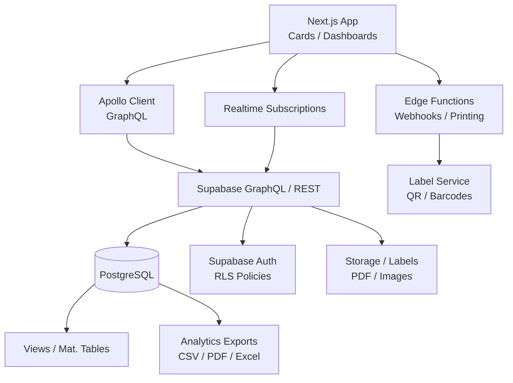
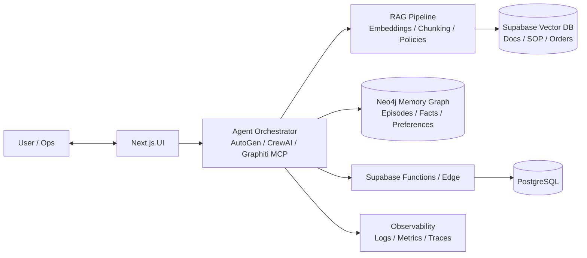

[AlexKwan_GitHub_Profile_README.md](https://github.com/user-attachments/files/22800645/AlexKwan_GitHub_Profile_README.md)
# 👋 Hi there, I'm **Alex Kwan (aiexkwan)**
💻 **Software Engineer | AI Systems Integrator | WMS Architect**  
📍 Based in Manchester, UK  

---

## 🧠 About
我專注於 **Web-based WMS（倉庫管理系統）**、**AI/ML 整合** 及 **製造業自動化**。  
目前以 **TypeScript + Next.js + Supabase + GraphQL** 為核心，結合 **AI Agent Orchestration** 與 **圖譜記憶（Neo4j）**，打造可持續演進的 SaaS 生態。

- 🔧 主導多個 **TypeScript + Supabase** 專案（SaaS 化、一體化設計）  
- 🧩 研究 **MCP servers、AI memory agents、可觀測性與可視化 dashboard**
- 🧾 習慣以文件驅動（架構決策、RLS 策略、性能指標、測試策略）

---

## 🚀 Featured Projects
| Project | Description | Tech | Activity |
|:--|:--|:--|:--|
| [**web-pennine-wms**](https://github.com/aiexkwan/web-pennine-wms) | 企業級 Web WMS（掃碼標籤、RLS、報表、卡片化 UI） | TypeScript · Next.js · Supabase · GraphQL | ⏱️ Active |
| [**online-stock-control-system**](https://github.com/aiexkwan/online-stock-control-system) | 在線存貨管理（多用戶、權限、報表） | TypeScript · Supabase | 📅 Ongoing |
| [**blog-with-comments**](https://github.com/aiexkwan/blog-with-comments) | 可評論的極簡網誌平台 | TypeScript | 🕓 Active |
| [**ai-sdk-starter-xai**](https://github.com/aiexkwan/ai-sdk-starter-xai) | 建構 AI-integrated SDK 的起步範本 | TypeScript | 🧩 Active |

> 🔎 更多專案（含私有倉庫）：WMS SaaS、AI Agent 工具鏈、可視化分析卡片

---

## 🧰 Tech Stack

  

- 前端：Next.js（App Router）、React、Tailwind、shadcn/ui  
- 後端：Supabase（Auth/RLS/Functions/Storage/Realtime）、Edge Functions  
- 資料：PostgreSQL、Row Level Security、GraphQL（Apollo + Codegen）  
- AI：RAG pipeline、Agent Orchestration（AutoGen / CrewAI / Graphiti MCP）、向量檢索  
- Dev：Docker、GitHub Actions、Playwright / Vitest

---

## 🧩 System Architecture (WMS)

---

## 🤖 AI Agent Orchestration (Memory-centric)

---

## 🌱 Learning & Research

- **RLS + user_metadata** 權限模型與審計追蹤  
- **Neo4j Memory Graph** & Data Lineage  
- **Automated RAG pipelines**（索引、策略、Prompt 組件化）  
- **MCP × Docker**：Tool-as-a-Service 整合  

---

## 📊 Stats

  
  

---

## 📫 Connect

  
  

---

### ✨ “Build systems that learn — and people who evolve.”
