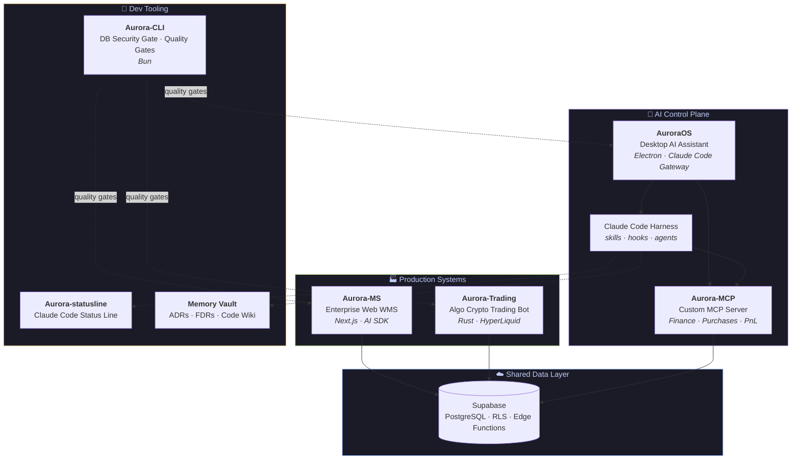

# Alex Kwan · `aiexkwan`

**Full-stack Engineer · AI-Augmented Builder** — Manchester, UK 🇬🇧

I build production systems across the full stack — **TypeScript** web apps, **Rust** trading engines — and wire them together with **AI agent orchestration**, a **custom MCP server**, and a heavily-tuned **Claude Code harness**.

---

## 🌌 Aurora Ecosystem

One shared data layer. Every project plugs into it.

```mermaid
graph TB
    subgraph DATA["☁️ Shared Data Layer"]
        DB[("Supabase<br/>PostgreSQL · RLS · Edge Functions")]
    end

    subgraph PROD["🏭 Production Systems"]
        WMS["<b>Aurora-MS</b><br/>Enterprise Web WMS<br/><i>Next.js · AI SDK</i>"]
        TRADE["<b>Aurora-Trading</b><br/>Algo Crypto Trading Bot<br/><i>Rust · HyperLiquid</i>"]
    end

    subgraph AI["🤖 AI Control Plane"]
        OS["<b>AuroraOS</b><br/>Desktop AI Assistant<br/><i>Electron · Claude Code Gateway</i>"]
        MCP["<b>Aurora-MCP</b><br/>Custom MCP Server<br/><i>Finance · Purchases · PnL</i>"]
        CC["Claude Code Harness<br/><i>skills · hooks · agents</i>"]
    end

    subgraph TOOLING["🧰 Dev Tooling"]
        CLI["<b>Aurora-CLI</b><br/>DB Security Gate · Quality Gates<br/><i>Bun</i>"]
        SL["<b>Aurora-statusline</b><br/>Claude Code Status Line"]
        VAULT["<b>Memory Vault</b><br/>ADRs · FDRs · Code Wiki"]
    end

    WMS --> DB
    TRADE --> DB
    MCP --> DB
    OS --> MCP
    OS --> CC
    CC --> MCP
    CC -.-> VAULT
    CC -.-> SL
    CLI -.->|quality gates| WMS
    CLI -.->|quality gates| TRADE
    CLI -.->|quality gates| OS

    style DATA fill:#1a1b26,stroke:#7aa2f7,color:#c0caf5
    style PROD fill:#1a1b26,stroke:#9ece6a,color:#c0caf5
    style AI fill:#1a1b26,stroke:#bb9af7,color:#c0caf5
    style TOOLING fill:#1a1b26,stroke:#e0af68,color:#c0caf5
```

| Project | Description | Tech | |
|:--|:--|:--|:--:|
| **Aurora-MS** | Enterprise Web WMS serving live manufacturing ops — label printing, route planning, RLS multi-tenancy, AI-assisted operations | TypeScript · Next.js · Supabase · AI SDK | 🔒 |
| **AuroraOS** | Local desktop AI assistant — Electron gateway control plane for Claude Code session orchestration | TypeScript · Electron · Supabase | 🔒 |
| **Aurora-Trading** | Algorithmic crypto trading bot — regime detection, risk management, live PnL tracking | Rust · HyperLiquid SDK · SQLx | 🔒 |
| **Aurora-MCP** | Custom MCP server — finance aggregation, purchase tracking, trading PnL, personal data tools | TypeScript · Supabase · Vercel | 🔒 |
| **Aurora-CLI** | Developer CLI — DB security gate, parallel quality gates, worktree state-machine merge, session analytics | TypeScript · Bun | 🔒 |
| **Memory Vault** | Cross-project knowledge store — ADRs, FDRs, decision records, code wiki | Markdown | 🔒 |

## 🌍 Open Source

| Project | Role | Description | Tech |
|:--|:--|:--|:--|
| [**Aurora-statusline**](https://github.com/aiexkwan/Aurora-statusline) | ⭐ Author | Rich status line for Claude Code — model, context, cache & cost tracking | TypeScript |
| [**agentpet**](https://github.com/ntd4996/agentpet) | 🤝 Contributor · 10 merged PRs | Native macOS menu bar desktop pet that monitors AI coding agents in real time | Swift · SwiftUI |
| [**TokenBar**](https://github.com/Nanako0129/TokenBar) | 🤝 Contributor · 2 merged PRs | AI token usage & quota monitor for the macOS menu bar — Liquid Glass, 3D contribution graph | Swift · Rust FFI |

---

## 🧰 Tech Stack

  

- **Web** — Next.js (App Router) · React · Tailwind · shadcn/ui · TanStack Query
- **Backend** — Supabase (Auth / RLS / Edge Functions / Realtime) · PostgreSQL
- **Systems** — Rust (async, workspace crates) · SQLx · HyperLiquid SDK
- **AI** — Custom MCP servers · Claude Code harness (skills / hooks / subagents / workflows) · Vercel AI SDK
- **Dev** — Bun · GitHub Actions · Playwright · Vitest

---

## 📊 Stats

  
  

---

## 📫 Connect

  
  

<i>"Build systems that learn — and people who evolve."</i>

